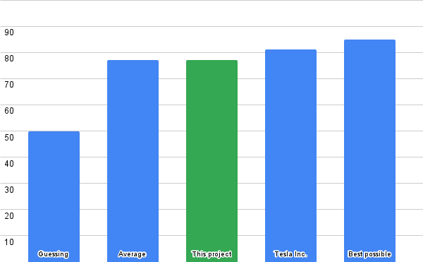

# Can AI create another AI?
### GitHub Copilot Challange - Kaggle "Spaceship Titanic" Competition


## The Challange:
I've created this project to answer the question:

**Can I create a decent machine learning code by writing mostly comments and let GitHub Copilot handle the actual code?**

For that I've decided to take part the [Kaggle Spaceship Titanic Competition](https://www.kaggle.com/competitions/spaceship-titanic). 
This is a public Kaggle competition where AI is trying to predict whether a passenger on a spaceship survived encounter with space anomaly. 

GitHub Copilot should create code for:
- Processing the data (e.g. loading, cleaning, extracting usable features and convert them to a format that can be used by the ML algorithm).
- Creating a machine learning models.
- Evaluating models to select optimal architecture and parameters.
- Training the model on data from Kaggle.
- Predicting the outcome of the test dataset.
- Exporting a CSV file with the predictions for upload to Kaggle.


## Rules:

 1. Everything written in Python.
 2. I can write all the comments I want and make them as long as I want.
 3. I can start writing code block by writing imports, naming a function or a class, defining the parameters and return type, but not the code itself.
 4. I can correct Copilot's code in a small ways. Example: casting variable to different type, changing variable name, add extra optional parameters, etc.
 5. No more than one fix per line.
 6. No fixing the line right next to already fixed one.
 7. I can use previous experience with machine learning to guide Copilot into creating a proper code (mostly in data-preprocessing part).
 8. I'll use a library that's new to me (autokeras) to handle most of the machine learning stuff, **so I don't have experience with actual ML code** in this project.

## Process:

As expected, GitHub copilot was a great help in writing the code fast. **This whole project was done in less than one day**.

There had to be some manual correction as Copilot was not able to write everything right. For example:
- Some variables were numbers, but the Copilot's code was expecting them to be strings (causing runtime errors).
- Copilot tried to add data to wrong dataframes.
- Copilot tried to use general filename schema like "train.csv" instead of actual filenames from the challenge.
- Column name "Transported" was often replaced with "Survived".

But overall, the code was written mostly well and fixing those bugs was still faster than writing everything from scratch.
I also assume I would make more bugs doing writing this code without Copilot's help.

Most notable place where creating a code was way faster than doing it manually was on the data preprocessing part 
as it's easier for me to describe how to transform the data than to remember specific syntax for pandas dataframe.

### Example:
```python
def process_data(path_to_csv):
    """
    Read content of csv data and create new csv data with columns adjusted for machine learning.
    """
    # Read data from csv file as pandas dataframe
    # Collumns are: PassengerId,HomePlanet,CryoSleep,Cabin,Destination,Age,VIP,RoomService,FoodCourt,ShoppingMall,Spa,VRDeck,Name,Transported
    input_data = pd.read_csv(path_to_csv)

    #Prepare new, empty dataframe for output
    output_data = pd.DataFrame()

    # Add PassangerId to output data
    output_data['PassengerId'] = input_data['PassengerId']
    
    # Add one-hot encoded columns for each option (Earth, Mars, Europa) in the HomePlanet column in input data.
    # Missing data is ignored.
    output_data['HomePlanet_Earth'] = input_data['HomePlanet'].apply(lambda x: 1 if x == 'Earth' else 0)
    output_data['HomePlanet_Mars'] = input_data['HomePlanet'].apply(lambda x: 1 if x == 'Mars' else 0)
    output_data['HomePlanet_Europa'] = input_data['HomePlanet'].apply(lambda x: 1 if x == 'Europa' else 0)

    # Add one-hot encoded column CryptoSleep based on the value in the CryoSleep column in input data.
    # If the value is 'True', the column is 1, otherwise 0. missing values are treated as 0.
    output_data['CryptoSleep'] = input_data['CryoSleep'].apply(lambda x: 1 if x == True else 0)

    # Create new dataframe for cabin data
    cabin_data = pd.DataFrame()
    # Add columns Cabin_p1, Cabin_p2 and Cabin_p3 to cabin_data based on the value in the Cabin column in input data.
    # The value of input data is a string, so we need to split it into three parts with "/" as separator.
    # The first part is the Cabin_p1, the second part is Cabin_p2 and the third part is Cabin_p3.
    # If the input data is empty, put None in the columns.
    cabin_data['Cabin_p1'] = input_data['Cabin'].apply(lambda x: str(x).split('/')[0] if len(str(x).split('/')) > 0 else None)
    cabin_data['Cabin_p2'] = input_data['Cabin'].apply(lambda x: str(x).split('/')[1] if len(str(x).split('/')) > 1 else None)
    cabin_data['Cabin_p3'] = input_data['Cabin'].apply(lambda x: str(x).split('/')[2] if len(str(x).split('/')) > 2 else None)

    # For cabin parts 1 from 'A' to G' add one-hot encoded columns to output data for each option (A,B,C,D,E,F,G)
    # Example: Cabin_p1_A = 1 if the value in Cabin_p1 is 'A', otherwise 0
    for letter in range(ord('A'), ord('G') + 1):
        output_data['Cabin_' + chr(letter)] = cabin_data['Cabin_p1'].apply(lambda x: 1 if x == chr(letter) else 0)

    # For cabin parts 2 add column Cabin_Number to output data. Value is the number in the second part of the cabin divided by 2000.
    # Example: Cabin_Number = 0 if the value in Cabin_p2 is empty, otherwise the value in Cabin_p2 divided by 2000.
    output_data['Cabin_Number'] = cabin_data['Cabin_p2'].apply(lambda x: 0 if x == None or str(x) == 'nan' else int(x) / 2000)

    # For cabin parts 3 add column to output data telling if the cabin is a type P cabin.
    # Example: Cabin_p3 = 1 if the value in Cabin_p3 is 'P', otherwise 0
    output_data['Cabin_P'] = cabin_data['Cabin_p3'].apply(lambda x: 1 if x == 'P' else 0)
```
## Results:
Accuracy (%) of generated preditions compared to the [Kaggle Leaderbord for this challenge](https://www.kaggle.com/competitions/spaceship-titanic/leaderboard):



At the time of writing this, my entry on Kaggle's Leaderboard is on place 1733 out of 2292, with the accuracy of **77.4%**.

Initially this sounds like a bad result, but average submission is just **77.9%** and results better than **80%** is reached at place 694 out of 2292.
Maximum accuracy ever achieved was **85%**. This results are typically submitted by a team of experienced AI researchers, like Universities or Tesla. Many of them are submitting more than 100 iterations before reaching 80%+ accuracy.

**77%** accuracy is actually an average score that is way closer to best submitted solution than to random guessing. 

Copilot was able to :
- Create decent AI code in just one evening.
- Do it with just minor fixes from my side.
- Get a decent score on this challenge **on the first try**. 
 
That is a great achievement!

## Conclusion:

YES! With a little help from human, AI can create another AI. We are all doomed.


